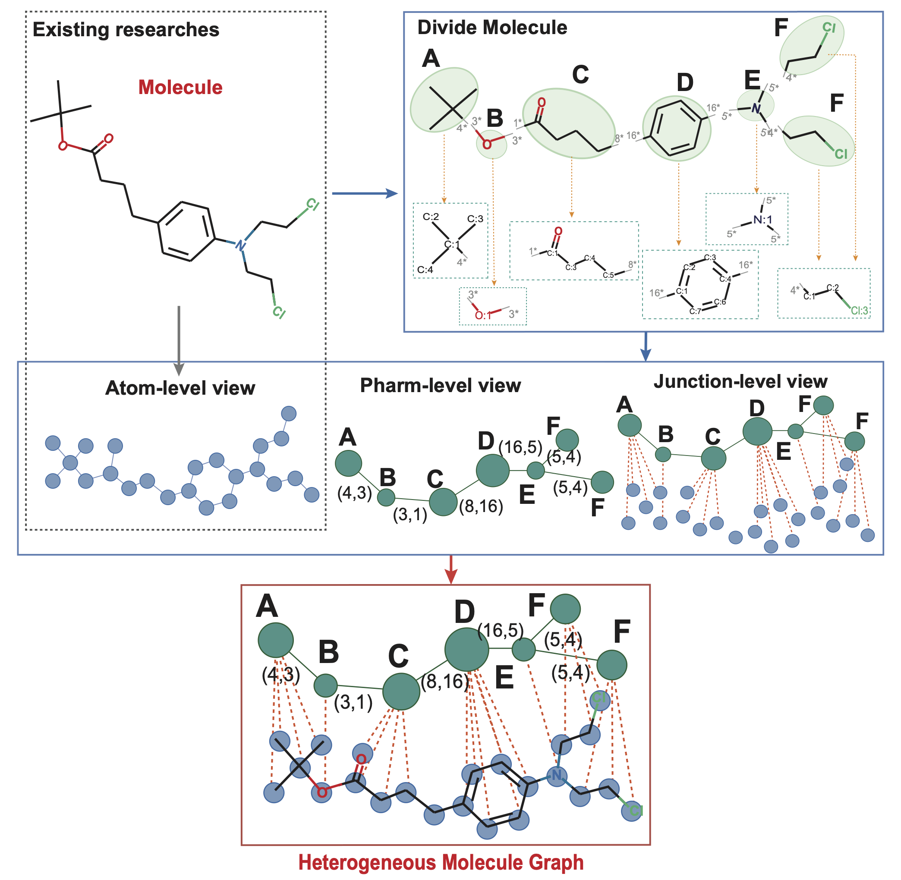

# PharmHGT

## Introduction
* Source code for the paper "Pharmacophoric-constrained Heterogeneous Graph Transformer".

* We design a pharmacophoric-constrained multi-views molecular representation graph, enabling PharmHGT to extract vital chemical information from functional substructures and chemical reactions. With a carefully designed pharmacophoric constrained multi-view molecular representation graph, PharmHGT can learn more chemical information from molecular functional substructures and chemical reaction information. 




## Dataset
All data used in this paper are publicly available on [Molecule-Net](http://moleculenet.org/datasets-1).

## Environment
* base dependencies:
```
  - dgl
  - wandb
  - numpy
  - pandas
  - python>=3.7
  - pytorch>=1.7.1
  - rdkit
```

## Usage

#### Quick Run
```bash
python train.py configs/esol.json
```
